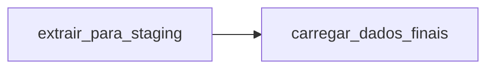

# 📌 ETL com Apache Airflow — Integração API → PostgreSQL

Este repositório contém meu **primeiro projeto utilizando Apache Airflow**, desenvolvido para orquestrar um fluxo ETL simples e modularizado.  
O objetivo principal foi consumir dados de uma API (CosmosPro), armazená-los em uma tabela *staging* e, posteriormente, carregá-los em uma tabela final no PostgreSQL.

---

## 🚀 Objetivos do Projeto

- Criar um **pipeline ETL real** usando Airflow.  
- Consumir dados de uma API autenticada via conexão configurada no Airflow.  
- Salvar registros em uma tabela de *staging* para manter o processo mais seguro e escalável.  
- Efetuar a carga final em uma tabela limpa, seguindo boas práticas de ETL.  
- Estruturar as funções de forma modular, facilitando a leitura, manutenção e evolução do pipeline.

---

## 🧩 Arquitetura Geral

O fluxo ETL foi dividido em duas etapas principais:

### **1️⃣ Extração para Staging**

- Busca a autenticação em uma API usando uma conexão criada no Airflow (`api_conn`).
- Realiza uma requisição POST à API.
- Cria (se não existir) e limpa a tabela `staging_usuarios_api`.
- Insere os dados brutos retornados pela API na tabela de staging.

### **2️⃣ Carga Final**

- Garante a existência da tabela `usuarios_api`.
- Limpa a tabela antes da nova carga.
- Copia os dados da tabela de staging para a tabela final.

---

## 🏗️ Estrutura da DAG

A DAG (`dag_etl_`) é composta por dois **PythonOperators**:

## 🔧 Tecnologias Utilizadas

- **Apache Airflow**
- **Python**
- **PostgreSQL**
- **Airflow Hooks**
  - `BaseHook` — autenticação da API
  - `PostgresHook` — conexão com o banco de dados
- **Requests** — biblioteca para chamadas HTTP

---

## 📂 Organização das Funções

O código foi modularizado em:

- Funções de **conexão** (API e Postgres)
- Função de **fechamento seguro** de conexão
- Função de **extração**
- Função de **carga**
- Definição da **DAG**

Essa estrutura torna o fluxo mais claro, organizado e fácil de manter.

---

## 📘 O que aprendi neste projeto

Este foi meu primeiro contato direto com o Airflow. Durante o desenvolvimento, aprendi:

- Como criar **DAGs e operadores**
- Como usar **Hooks** para conectar com API e banco de dados
- Como estruturar um **ETL modular**
- Como trabalhar com tabelas de **staging**
- Como organizar um **pipeline escalável** de forma profissional
